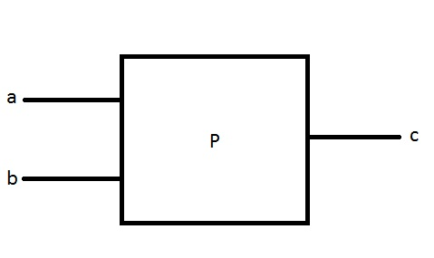

> #### *Adicion*

> - Asignatura: Algoritmos y Estructura de Datos
> - Curso: k1051
> - Año: 2017
> - Cuatrimestre: Primer Cuatrimestre

> #### *Usuarios*
> - ecremella
> - 156.602-7
> - Cremella Enzo

# Enunciado

Dar los pasos para mostrar la suma de dos números ingresados por el usuario

## Análisis

1) Debemos pedir al usuario dos números (en este caso solicitamos dos números enteros)
2) Se ingresan los dos números
3) Se leen los dos números
4) Se debe mostrar por pantalla la sumatoria de los dos números ingresados 

## Algoritmo  

| a,b,c ∈ Z |
| :---: |
| **Leer a** |
| **Leer b** |
| **c ← a+b** |
| **Escribir c** |
